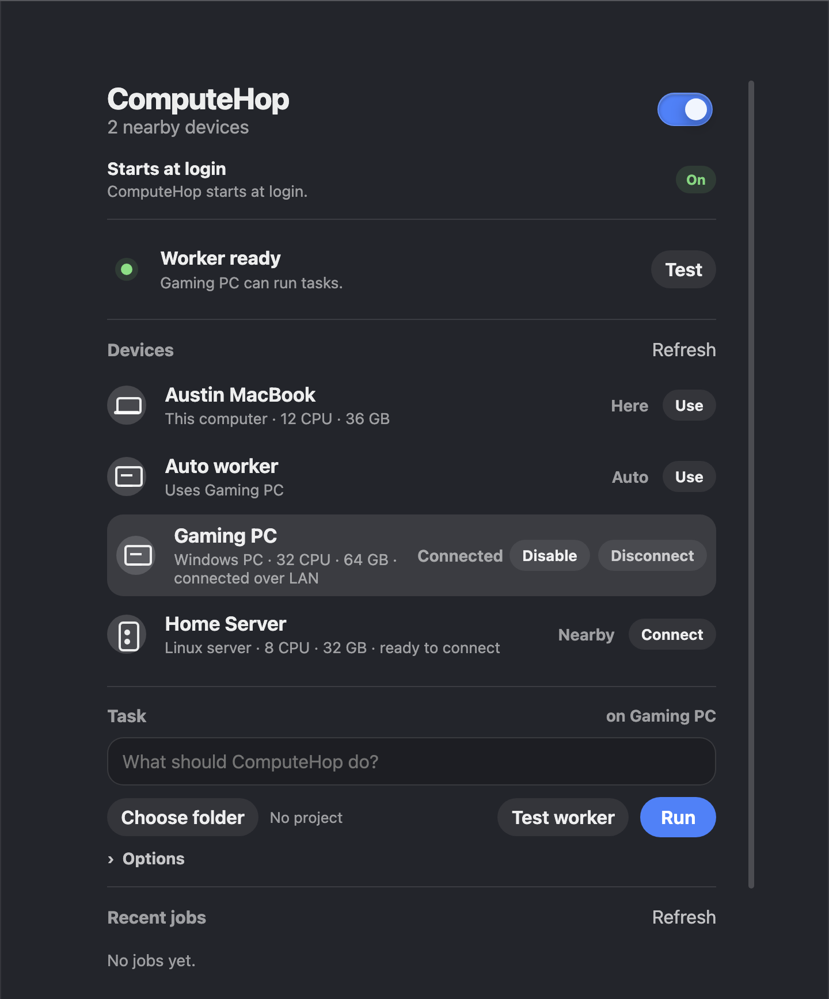
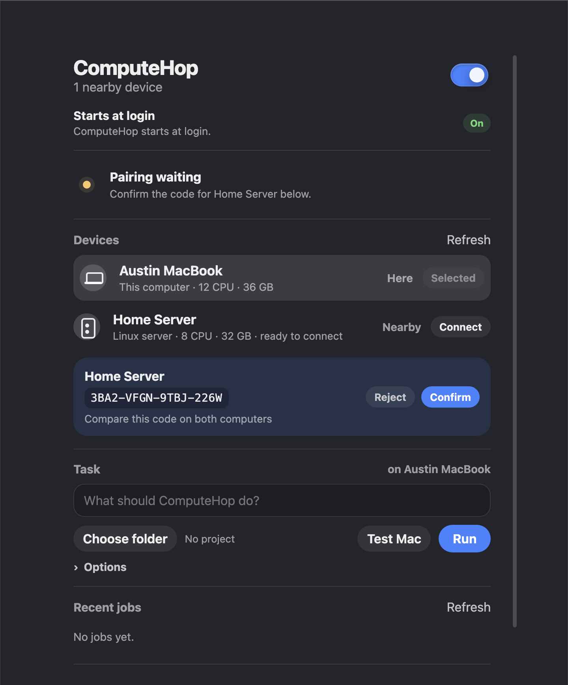
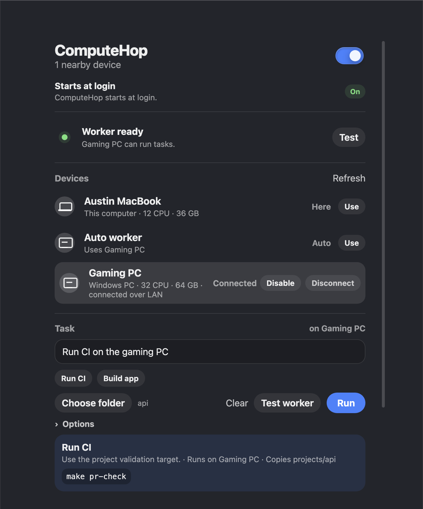

# ComputeHop setup guide

ComputeHop turns your own computers into places you can send background work.
The first public path is simple: install the app on your Mac, install a worker
on another computer, connect them on the same network, then run tasks from the
Control Center.

## 1. Open ComputeHop

Start ComputeHop on your Mac. The Control Center should show this Mac, any
nearby workers, and whether ComputeHop is installed to start at login.



The main states are:

- **This computer** — the Mac you are using right now.
- **Nearby** — another computer has ComputeHop open on the same network but is
  not trusted yet.
- **Connected** — the computer is paired and can receive tasks.
- **Auto worker** — ComputeHop can choose the only available worker for you.

Use **Connect** when you see the computer you want to trust.

## 2. Pair the computers

Pairing prevents random devices on your network from receiving jobs. When
ComputeHop shows a verification code, compare the code on both computers.



Only press **Confirm** if the code is identical on both screens. If it differs,
reject the pairing and start again.

## 3. Choose where work should run

Select a device in the device list. Choose **This Mac** for local work or a
connected worker when you want to offload builds, tests, video jobs, Docker
builds, or other background commands.

When a single connected worker is available, **Auto worker** is usually the
simplest choice.

## 4. Choose a project folder

Use **Choose folder** for project work such as:

- running CI;
- building an app;
- running tests;
- packaging artifacts;
- restoring output files after a remote job.

Project snapshots respect `.gitignore`, `.computehopignore`, and ComputeHop's
default exclusions for common secrets, dependency folders, build outputs, and
caches.

## 5. Ask ComputeHop to run the task

Type what you want in plain language. ComputeHop first tries local deterministic
planning, then optional AI planning if you configure an OpenAI-compatible API
key in Advanced settings.



Examples:

- `Run CI on the gaming PC`
- `Build the app on the worker`
- `Run tests here`
- `Run Docker build on Linux`
- `Test connection`

If preview mode is on, ComputeHop shows the exact command before it runs. Press
**Run** after the plan looks right.

## 6. Bring files back

Open **Options** and list files or folders to return after the task succeeds.
Use comma-separated paths such as:

```text
dist, build/report.json, output/video.mp4
```

ComputeHop restores declared outputs without overwriting existing files. If a
destination already exists, it keeps the conflict aside instead of deleting your
local file.

## 7. Disconnect a worker

Use **Disconnect** on a worker when you no longer want this Mac to trust it.
That revokes local trust for the worker. Pair again if you want to use it later.

## Current limitations

- Public macOS artifacts are not ready until Developer ID signing,
  notarization, and clean-machine validation are complete.
- Off-LAN work requires the staged VPS/TURN setup and physical validation.
- Linux and Windows workers currently ship as archives with per-user service
  installer scripts, not polished native installers.
- GUI apps, gaming, and remote desktop are intentionally out of scope.
